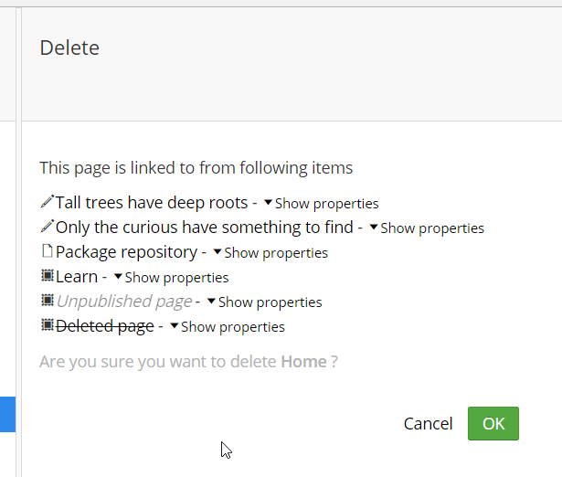

# Introduction #

After installing this package all your internal links will be tracked in Umbraco. This way a content editor can see where a page or media items is used when trying to delete or unpublishing a page and will prevent broken links

## How does it work ##

When content is saved the package will parse all the properties that have a parser configured and store the related items as a relation in Umbraco.

### Delete warnings and unpublish warnings ###

When you try to delete or unpublish a item that is linked to from anothe item you will get a warning that it is used by other items. You can also see in which property the link is created.

Pages that are unpublished will display in italic and greyed out.
Pages in the recycle bin will be displayed as strike through

Delete dialog

Unpublish dialog

### Nexu dashboard ###

In the developer section a dashboard is added that allows you to rebuild all the relations. This happens in a background thread, so once you have pushed the button you can continue working in the backoffice. You can go back to the dashboard to check the status.

## Supported property editors ##

### Core property editors ###
- Rich text editor
- Content picker
- Multinode tree picker (content and media)
- Grid
- Related links
- Media picker
- Multiple Media picker

### Community property editors ###
- [Nested Content](https://our.umbraco.org/projects/backoffice-extensions/nested-content/)
- [Vorto](https://our.umbraco.org/projects/backoffice-extensions/vorto)
- [Multi Url Picker](https://our.umbraco.org/projects/backoffice-extensions/multi-url-picker/)

## Supported grid editors ##

### Core grid editors ###
- Grid
- Media

### Community grid editors ###
- [Doc Type Grid Editor](https://our.umbraco.org/projects/backoffice-extensions/doc-type-grid-editor/)

